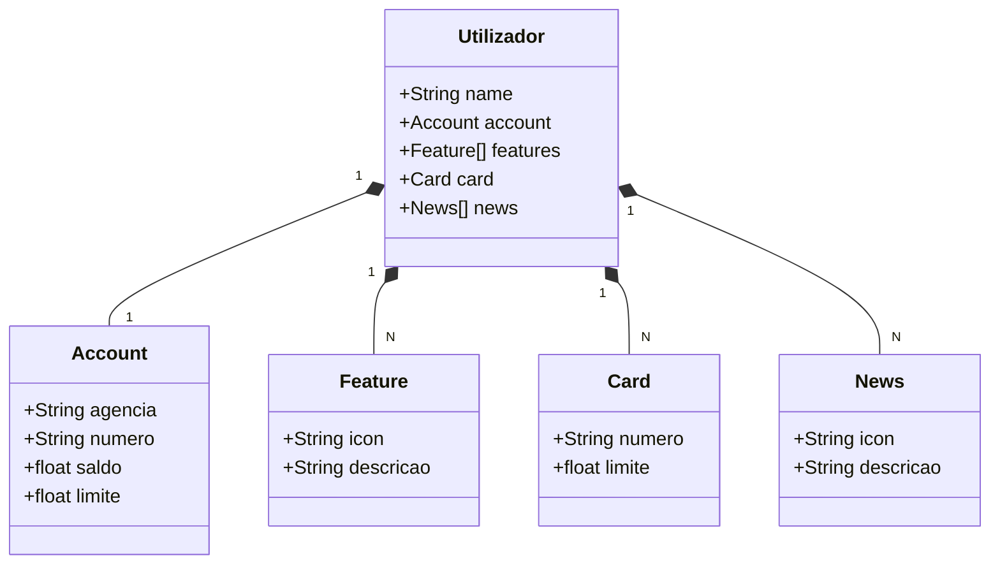

# Santander BootCamp
Java RESTful API cirada para DIO java BootCamp.

##Diagrama de classes

```mermaid
classDiagram
    class Utilizador {
        +String name
        +Account account
        +Feature[] features
        +Card card
        +News[] news
    }

    class Account {
        +String agencia
        +String numero
        +float saldo
        +float limite
    }

    class Feature {
        +String icon
        +String descricao
    }

    class Card {
        +String numero
        +float limite
    }

    class News {
        +String icon
        +String descricao
    }

    Utilizador "1" *-- "1" Account
    Utilizador "1" *-- "N" Feature
    Utilizador "1" *-- "N" Card
    Utilizador "1" *-- "N" News
```
